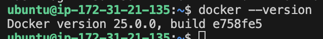

### TASK2 Description

###### Part1 
1. Install Docker in EC2 Ubuntu instance by terraform +++
2. In docker container add web-site

###### Part2 
1. Using sheduler ( cron job ) setup backup for docker container for every morning
2. using terraform create s3 bucket 
3. move backup file to s3 bucket (terraform)
4. setup email agent and send created raport message about backup to email adress

###### Part3 
1. check if backup working properly by running container on the server

#### WHAT WAS DONE
1. install docker engine to ec2 Ubuntu instance by : [docker docks manual](https://docs.docker.com/engine/install/ubuntu/#install-using-the-repository)

2. Clone repository from GitHub with website
3. Add to this website Dockerfile and create docker image
4. Run docker container on nginx server 
5. Install AWS CLI and add credentials
6. Create s3 bucket
7. Create backup script that include 
    - create a backup of the Docker container
    - upload backup container to the s3 bucket
    - remove local backup file
8. Make sure that script executable
9. Config Crontab to shedule backup

##### FIXED PROBLEMS

##### USEFULL MATERIALS
> git commit -m --allow-empty : allow commits without message

build my website docker image
> sudo docker build -t portfolio-image ~/portfolio-website/

run my website docker container
> sudo docker run -d -p 80:80 --name portfolio-container portfolio-image

download aws cli
> sudo apt-get install awscli -y
> aws configure

create s3 bucket
> aws s3api create-bucket --bucket backup-pavlo-test-website --region eu-central-1 --create-bucket-configuration LocationConstraint=eu-central-1

Create a backup of the Docker container
> docker export -o "backup-$(date +\%Y\%m\%d-\%H\%M\%S).tar.gz" "portfolio-container" | gzip -f

Upload the backup file to S3 bucket
> sudo aws s3 cp "backup-20240121-213510.tar.gz" "s3://backup-pavlo-test-website/backup-20240121-213510.tar.gz"

Remove the local backup file
> rm "backup-20240121-213510.tar.gz"

Make the script executable:
> chmod +x backup_script.sh

Run the script manually to ensure it's working correctly:
> ./backup_script.sh

Open your crontab configuration:
> crontab -e

Add a line to schedule the script daily at 8:00 AM:
> 0 8 * * * /path/to/backup_script.sh

