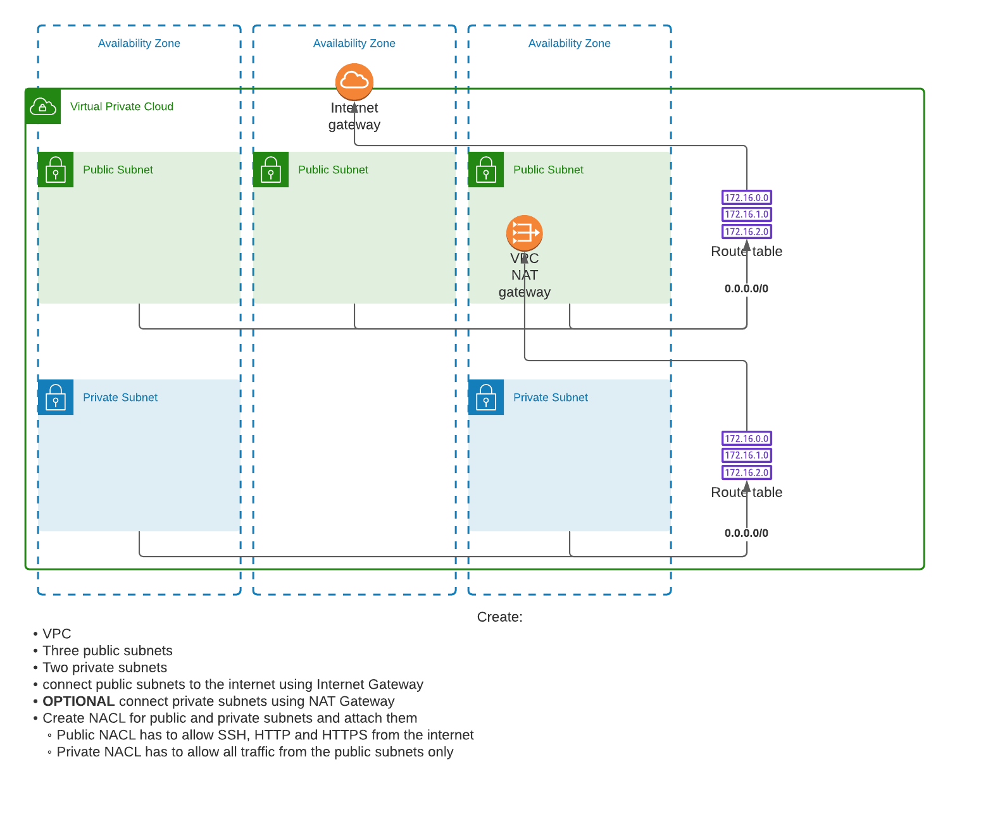
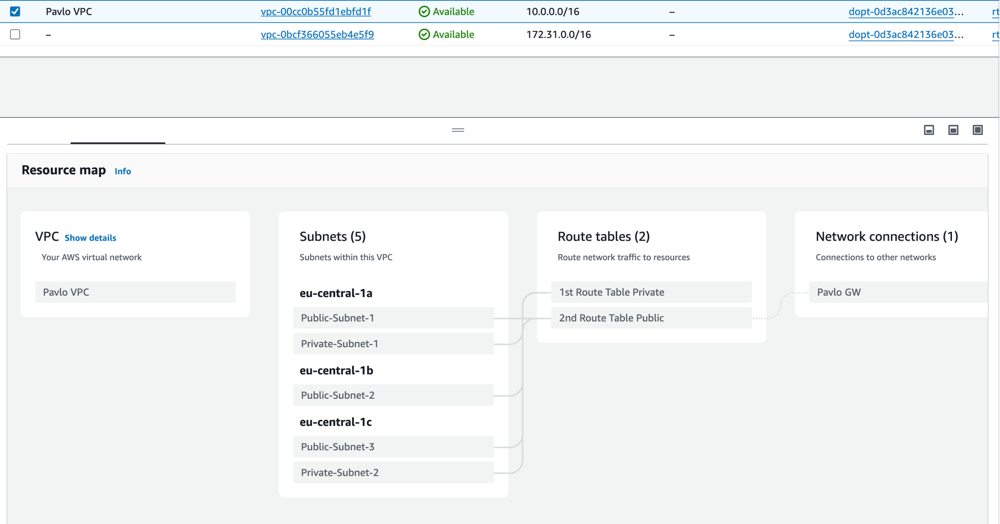

### TASK3 Description

###### THEORY
1. Udemy: сети с нуля просто о сложном +++ 
2. AWS VPC : youtube idv-it +++

1. Theory Virtualization : watch matherials 06
2. [Ansible Theory!!!](https://www.youtube.com/playlist?list=PLg5SS_4L6LYufspdPupdynbMQTBnZd31N) + 07 Materials 
3. Vagrant, Chief, Puppet - ознайомитись (get acquainted)
4. Jenkins Watch 

###### PRACTICE
1. Manually Inside AWS CLOUD PANNEL +++ 
  

2. The same by terraform  

#### WHAT WAS DONE

###### 1. Manually in AWS CLOUD PANNEL
1. Create VPC
2. Create Gateway and attach to VPC ( now we have access to internet from our VPC )
3. Create 3 public subnets in 3 different avaliability zones : ( add public api because default they privat)
4. Add public gateway to routing table 
5. create 2 private subnets (no public ip)
6. add NAT Gateway with Elastic API and add it to private route tables Routes
======
Cool our VPC ready to use 
======
1. Create Auto Scalling Group: 
  - create launch template
2. Create instanse inside private subnet and enter to it from public subnet instance

###### 2. By terraform file

  

##### USEFULL MATERIALS

- [terraform aws vpc](https://spacelift.io/blog/terraform-aws-vpc)

