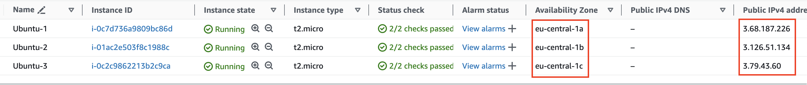
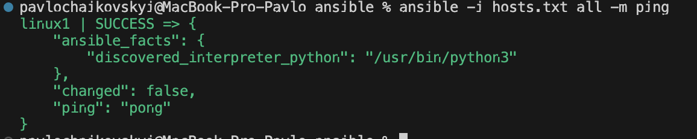

### TASK4 Description

###### THEORY
1. Theory Virtualization : watch matherials 06
2. [Ansible Theory!!!](https://www.youtube.com/playlist?list=PLg5SS_4L6LYufspdPupdynbMQTBnZd31N) + 07 Materials 
3. Vagrant, Chief, Puppet - (get acquainted)
4. Jenkins Watch 

###### PRACTICE

#### WHAT WAS DONE
  - Private VPC : 3 AZ / 3 Public Subnets / 3 Instances in each / 
   
  - Launch to ec2 instance with ansible 
   

##### USEFULL MATERIALS

aws cli : get list of ec2 instances public ip  
> aws ec2 describe-instances --query 'Reservations[].Instances[].[InstanceId, PublicIpAddress]' --output table

> ansible -i hosts.txt all -m ping
> ansible all -m ping